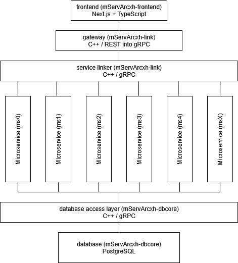

# mServArcxh
Main repository for documentation, architecture, etc.

## About mServArcxh
Project mServArcxh is an all-encompassing, plugabble personal utility/tools repository. mServArcxh uses a microservice architecture with clear, strict service isolation. That is, all microservices, though interconnectable, can only communicate via predefined service communication routes and layers.

## mServArcxh Architecture

Project mServArcxh is composed of the following layers:

- **Frontend**  
  - A Next.js + TypeScript application.  
  - Provides the user interface and communicates exclusively with the Link Layer.

- **Link Layer**  
  - Handles all external requests and routes them to the appropriate microservice.  
  - Composed of:
    - **Gateway** – the public API entry point; manages authentication, validation, and request dispatch.
    - **Service Link** – an internal routing layer that connects microservices.

- **Microservices**  
  - Independent C++ services (e.g., Budgeting, Scheduling, Health Tracker, etc).
  - Each microservice contains only its domain-specific business logic.
  - Microservices do not directly access the database; all data operations go through the Database Access Layer.

- **Database Layer (`mServArcxh-dbcore`)**  
  - Centralized schema ownership and data access.
  - Composed of:
    - **PostgreSQL instance** – stores all persistent data.
    - **DAL (Data Access Layer)** – a C++ gRPC service that provides structured access to the database.
  - The DAL and PostgreSQL each run in separate containers and communicate over Docker’s internal network.

